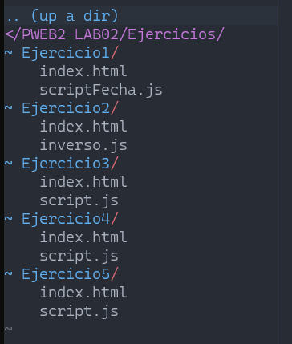
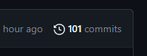
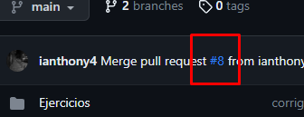
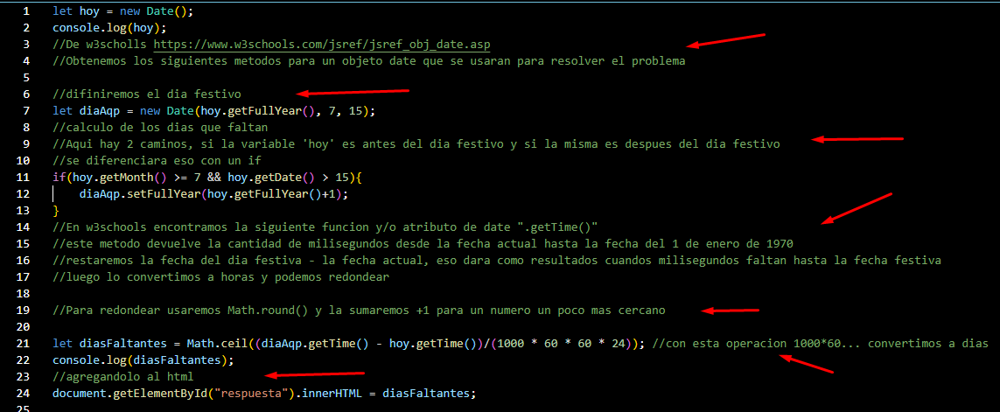
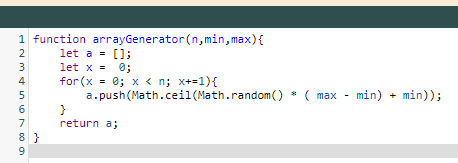
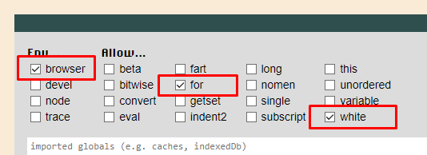
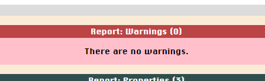
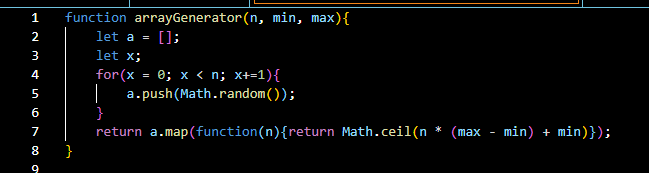

<table>
    <theader>
        <tr>
            <td></td>
            <th>
                UNIVERSIDAD NACIONAL DE SAN AGUSTIN 
                FACULTAD DE INGENIERÍA DE PRODUCCIÓN Y SERVICIOS 
                ESCUELA PROFESIONAL DE INGENIERÍA DE SISTEMAS
            </th>
            <td></td>
        </tr>
    </theader>
    <tbody>
        <tr><td colspan="3">Formato: Guía de Práctica de Laboratorio / Talleres / Centros de Simulación</td></tr>
        <tr><td>Aprobación:  2022/03/01</td><td>Código: GUIA-PRLD-002</td><td>Página: 1</td></tr>
    </tbody>
</table>

INFORME DE LABORATORIO 
(formato de estudiante)

<table>
<theader>
<tr><th colspan="6">INFORMACIÓN BÁSICA</th></tr>
</theader>
<tbody>
<tr><td>ASIGNATURA:</td><td colspan="5">Programación Web 2</td></tr>
<tr><td>TÍTULO DE LA PRÁCTICA:</td><td colspan="5">JavaScript</td></tr>
<tr><td>ENLACE DEL REPOSITORIO:</td><td colspan="5">https://github.com/ianthony4/PWEB2-LAB02</td></tr>
<td>NÚMERO DE PRÁCTICA:</td><td>01</td><td>AÑO LECTIVO:</td><td>2023 A</td><td>NRO. SEMESTRE:</td><td>III</td>
</tr>
<tr>
<td>FECHA DE PRESENTACIÓN:</td><td colspan="2">14-05-2023</td><td>HORA DE PRESENTACIÓN:</td><td colspan="2">20:00</td>
</tr>
<tr><td colspan="4">INTEGRANTE (s):
<ul>
<li>Chaisa Fernandez, Anthony Leonel</li>
</ul>
</td>
<td>NOTA:</td><td>Pendiente</td>
</tr>
<tr><td colspan="6">DOCENTES:
<ul>
<li>Carlo Jose Luis Corrales Delgado (ccorrales@unsa.edu.pe)</li>
<li>Richart Smith Escobedo Quispe (rescobedoq@unsa.edu.pe)</li>
</ul>
</td>
</tr>
</tbody>
</table>
<table>
<theader>
<tr><th>SOLUCIÓN Y RESULTADOS</th></tr>
</theader>
<tbody>
<tr><td>I. SOLUCIÓN DE EJERCICIOS/PROBLEMAS 
A. Solucion del Trabajo Grupal
<ul>
Desde el ejercicio 1 hasta el 5, solo se crearon 2 archivos:
<li>index.html</li>
<li>script.js</ls>
 
</ul>
B. Este laboratorio se desarrollo con los siguientes aspecto:
<ul>
<li>Bastantes explicaciones del desarrollo de cada ejercicio, mas de 100 commits</li>
 
<li>Se realizaron al rededor de 8 MERGE, donde cada 5 representan la culminacion de cada Ejercicio (1 al 5)</li>
 
<li>Se realizaron comentarios de manera muy explicita (en los .js) para saber que funcion en el codigo realiza cada elemento utilizado
 
</ul>
C. Elementos utilizados: 
<ul>
Algunos elementos NUEVOS y NOTABLES que utilizamos para el desarrollo de estos ejercicios 
 De HTML 
<li>onclick : Llama a la funcion vinculada al script</li>
<li>id's : Permiten identificar y hacer unicos a ciertos elementos del HTML, para extraer su informacion.</li>
<li>Etiqueta - DIV : Identificada con un ID, permite modificar/eliminar solo esa estructura del HTML</li>
<li>console.log() : Permitio probar el valor de la variables en el navegador</li>
 De JavaScript/DOM 
<li>innerHTML : Remplaza partes del html, sin recargar la pagina</li>
<li>getElementById() : Obtiene el elemento de ese ID especifico</li>
<li>value : junto al getElementById() extraemos ese valor y lo almacenamos en una variable</li>
<li>new Date() : Permite crear objetos de tipo DATO y TIEMPO</li>
<li>Math : Los diferentes metodos de la clase Math, permitieron redondear, generar aleatorios</li>
<li>push : Este metodo agrega elementos a nuestro arreglo </li>
</ul>
<h1>Enlace Flipgrip</h1>
<li>enlace</li>
</td></tr>
<tr><td>II. SOLUCIÓN DEL CUESTIONARIO  
A. ¿Como se puede resolver los warning?  
<li>Unexpected let: Se puede solucionar eliminando la palabra clave "let"</li>
<li>Expected ";" and instead saw "}": Debemos agregar un ";" al final del return</li>
<li>Expected "+=1" and instead saw "++": Modificaremos el incremento del for "++"
por la sugerencia "+=1"</li>
<li>Codigo Original</li>

<li>Codigo Corregido</li>

<li>Por otro lado, tambien se tienen que activar ciertas opciones para que el ciclo FOR funcione</li>

<li>De esa forma el codigo queda sin WARNINGS</li>

  B. ¿Se puede modificar la solución usando map?¿Cómo?  
<li>Podemos primero iniciar un arreglo con "n" número de elementos random con ayuda de Math.random() y luego hacer un map a todos esos elementos de la siguiente manera </li>
 
</td></tr>
<tr><td>III. CONCLUSIONES
<ul>
<li>
1.
</li>
<li>
2.
</li>
</ul>
</td></tr>
</tbody>
</table>
<table>
<theader>
<tr><th>RETROALIMENTACIÓN GENERAL</th></tr>
</theader>
<tbody>
</table>
<table>
<theader>
<tr><th>REFERENCIAS Y BIBLIOGRAFÍA</th></tr>
</theader>
<tbody>
<tr><td>I. BIBLIOGRAFÍA
<ul>
<li>https://www.w3schools.com/js/default.asp </li>
<li>https://www.w3schools.com/html/default.asp</li>
</ul>
</td></tr>
</tbody>
</table>
                                                                                                                                                                                       
